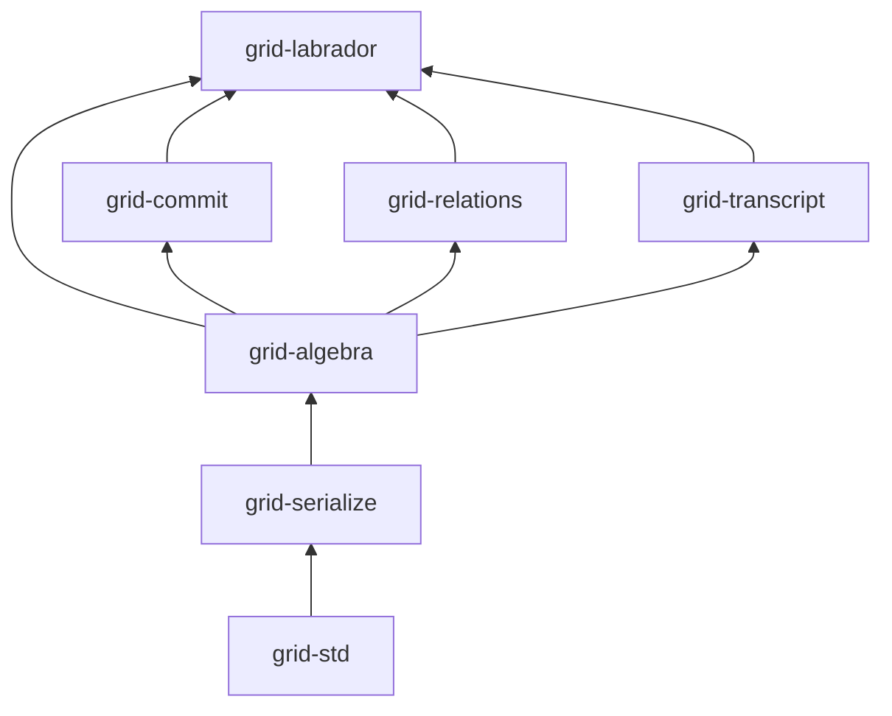

# Gridland — Status And Roadmap

A layered Rust workspace for lattice-based cryptography, commitments, and proof systems.

## Status Snapshot

| Area | Status | Notes |
|---|---|---|
| Foundation & Algebra | Complete | Base crates and algebra layer are in use across the workspace |
| Commitments | Complete | Ajtai, BDLOP, and gadget commitments shipped |
| Relations / Transcript | Complete | SHAKE-backed byte flow plus canonical field-native Poseidon2 transcript surfaces shipped |
| LaBRADOR | Complete for current scope | Generic prover/verifier, examples, and tests |

## Completed Work

### Foundation & Algebra

Delivered the shared base crates and algebra substrate used by the whole workspace:

- `grid-std`
- `grid-serialize`
- `grid-algebra::arith`
- `grid-algebra::poly`
- `grid-algebra::lattice`

This work established the reusable ring, polynomial, lattice, serialization, and `no_std`
infrastructure that later crates build on. The first large-prime and fixed-profile large-RNS
milestone is now shipped under [large_modulus_support.md](large_modulus_support.md); prime-power
rings, prepared/NTT large-modulus acceleration, and basis-aware / dynamic-basis expansion remain
follow-up work.

### Commitments

Delivered the reusable commitment layer in `grid-commit`:

- shared commitment traits and error surface
- shared linear commitment model and validation helpers
- Ajtai commitment
- BDLOP commitment
- gadget commitment
- explicit NTT-native Ajtai / BDLOP runtime interfaces for polynomial-coefficient inputs

This work gives later protocol crates a stable commitment API with serializable parameters,
keys, openings, commitments, deterministic recomputation paths, explicit NTT-native runtime
entry points for polynomial workloads, and `Rq23Np8` benchmarks.

### Relations & Transcript

Delivered the shared interface layer used by later protocols:

- `grid-relations` with toy R1CS / CCS and norm-tracked witnesses
- `grid-transcript` with shared framing, SHAKE, canonical field-native encoding, and Poseidon2
- protocol-facing interfaces live in the crates that use them

This scope is complete. The SHAKE-backed path remains in use by
`grid-labrador`, and the field-native Poseidon2 surface is available to protocol crates.
Goldilocks profile provenance is recorded in
[poseidon2_goldilocks_profile.md](poseidon2_goldilocks_profile.md).

### LaBRADOR

Delivered the first end-to-end proof system in the workspace:

- generic LaBRADOR relation, parameter, CRS, proof, prover, and verifier modules
- public API: `prove` / `verify`
- binary R1CS, arithmetic R1CS mod `2^d+1`, and mixed reduction helpers
- end-to-end CRS / prove / verify flow
- (no snark adapter for LaBRADOR — dependency was unused)
- runnable Fibonacci example and tests

The LaBRADOR crate is complete for the current scope, but secure parameter generation and
zero-knowledge hardening remain follow-up work.

## Workspace Crates

| Crate | Purpose |
|---|---|
| `grid-std` | `no_std` compatibility layer and shared helpers |
| `grid-serialize` | Canonical serialization / deserialization / validation traits |
| `grid-algebra` | Arithmetic, polynomial rings, lattice containers, sampling |
| `grid-commit` | Ajtai, BDLOP, and gadget commitments |
| `grid-relations` | R1CS / CCS relation containers with norm-tracked witnesses |
| `grid-transcript` | Shared Fiat-Shamir transcript traits and backends |
| `grid-labrador` | Generic LaBRADOR prover/verifier core |

## Layering

## Open Work

| Topic | Status | Notes | Details |
|---|---|---|---|
| LaBRADOR parameter generation | Planned | Move from profile-driven parameters to statement-driven parameter generation | [../labrador/parameter.md](../labrador/parameter.md) |
| Large modulus support | Partial | First scalar large-prime and fixed-profile large-RNS milestone shipped; prepared/NTT/transcript widening remains follow-up work | [large_modulus_support.md](large_modulus_support.md) |
| LaBRADOR proof hardening | Deferred | Current proof path still needs stronger privacy / zero-knowledge hardening | [techdebts.md](techdebts.md) |
| Performance and backend expansion | Ongoing follow-up | SIMD, backend coverage, and other non-blocking improvements | [techdebts.md](techdebts.md) |

## Doc Ownership

Use this file as the workspace status index. Keep detailed status in the owning subsystem doc, and
keep secondary docs focused on their narrower role:

- [large_modulus_support.md](large_modulus_support.md): large-prime and large-RNS support boundary
- [simd.md](simd.md): shipped SIMD behavior and SIMD-specific follow-up work
- [commit_backend_support.md](commit_backend_support.md): commitment backend support boundary
- [../labrador/parameter.md](../labrador/parameter.md): LaBRADOR parameter surface and generation roadmap
- [techdebts.md](techdebts.md): open follow-up items only, not a second status snapshot
- [../bench.md](../bench.md): benchmark workflow and reference results only

## Related Docs

- [LaBRADOR parameters](../labrador/parameter.md)
- [large_modulus_support.md](large_modulus_support.md)
- [rns_context.md](rns_context.md)
- [poseidon2_goldilocks_profile.md](poseidon2_goldilocks_profile.md)
- [techdebts.md](techdebts.md)
